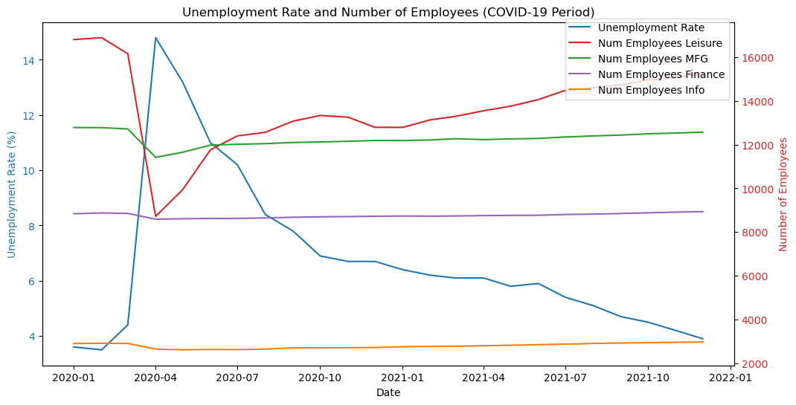
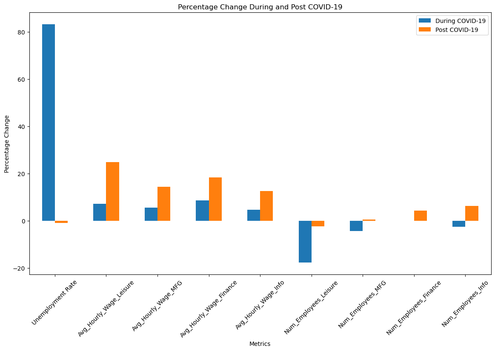
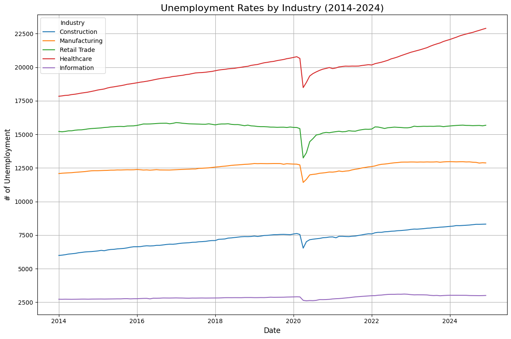
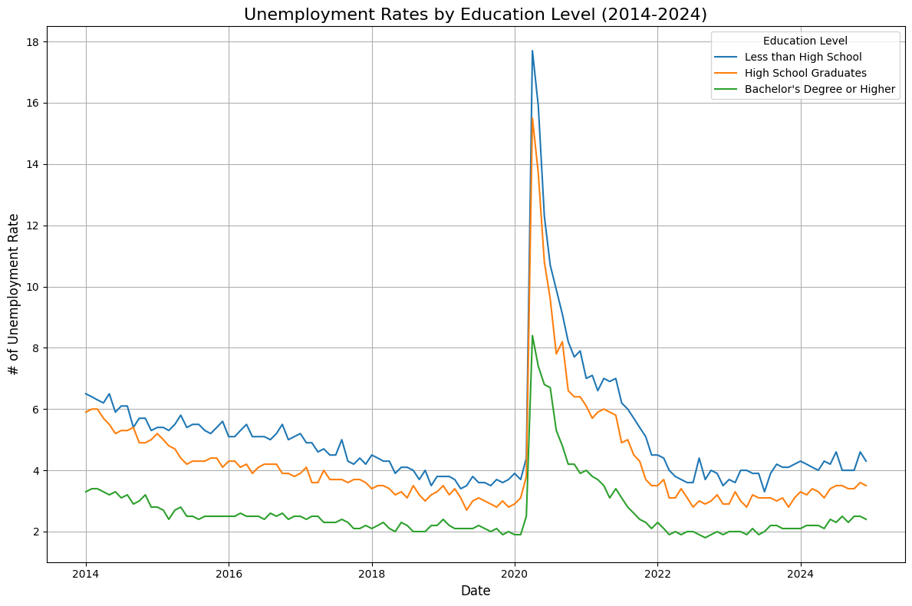
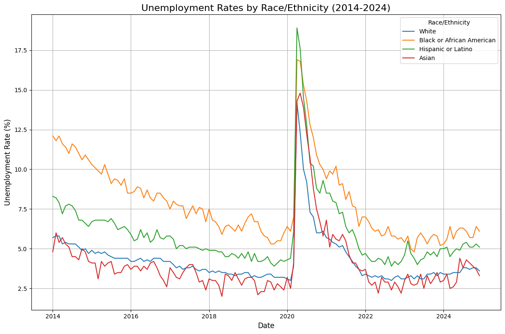
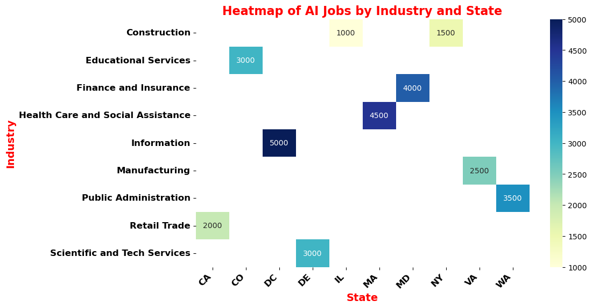
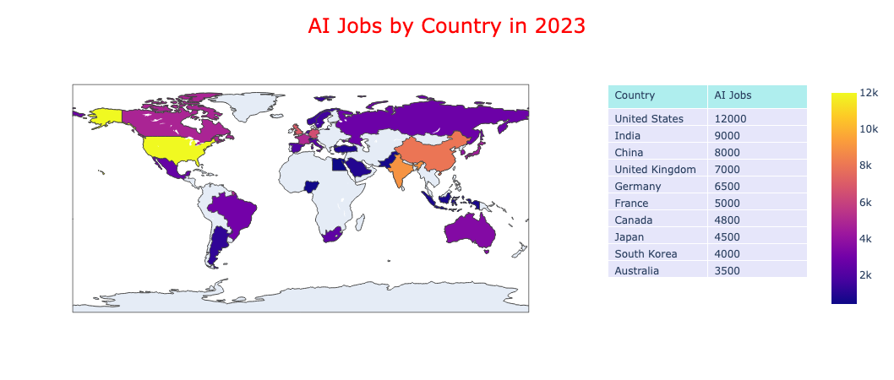

# group3-project-25.02.01
# Project Title: Unemployment Rate Analysis

## Introduction
This project aims to analyze the unemployment rate in the United States, focusing on various factors such as the impact of AI, industry sectors, education levels, and the effects of COVID-19.

## Areas of Investigation

### Impact of AI on the Labor Market
1. **Impact of AI in the Past 10 Years**  
   - A heatmap was created to visualize the distribution of AI jobs across various industries and states in 2023. The heatmap uses darker shades to represent higher concentrations of AI jobs. It highlights industries such as Information and Scientific and Technical Services, which show significant numbers of AI jobs in states like California and Massachusetts. This visualization helps identify trends and concentrations of AI employment, which can guide strategic decision-making and workforce development in the AI sector.
   - A choropleth map was created to visualize the distribution of AI jobs across various countries in 2023. In this map, color intensity indicates the number of AI jobs, with darker shades representing higher concentrations. The map highlights global hotspots for AI employment and provides insights into how different countries are adopting and integrating AI technologies.

### Unemployment and Economy/Industry Sectors
1. **Unemployment and Industry Sectors**  
   Unemployment is often affected differently across various industry sectors, as economic conditions, technological advances, globalization, and other factors impact sectors in unique ways.  
   - **Cyclicality of the Industry**  
      - Highly Cyclical Industries: Construction, manufacturing, and hospitality are more sensitive to economic cycles. Recessions reduce demand for discretionary goods, leading to layoffs.  
      - Resilient Industries: Healthcare, education, and utilities are less affected due to the essential services they provide.  
   - **Technology and Automation**  
      - Vulnerable Industries: Manufacturing, retail, and transportation face structural unemployment due to automation.  
      - Benefiting Industries: Technology, finance, and renewable energy often see growth due to innovation.  
   - **Pandemics and Disruptions**  
      - COVID-19 severely affected travel, hospitality, and retail while boosting demand in e-commerce, healthcare, and logistics.

2. **Unemployment by Education Level**  
   Higher education levels generally correlate with better job prospects, lower unemployment, and higher wages:  
   - **Lower Education Levels**: Highest unemployment rates, with jobs vulnerable to outsourcing and automation.  
   - **High School Graduates**: Moderate unemployment rates in sectors like construction and retail.  
   - **Some College or Associate's Degree**: Improved employability in healthcare and IT support.  
   - **Bachelor's Degree or Higher**: Lowest unemployment rates, with opportunities in technology, healthcare, and finance.  

3. **Unemployment by Race/Ethnicity**  
   The Bureau of Labor Statistics (BLS) reports significant disparities:  
   - **Black or African American**: Highest unemployment rates.  
   - **Hispanic or Latino**: Higher than White but lower than Black workers.  
   - **White**: Lower overall unemployment rates.  
   - **Asian**: Lower rates but significant diversity within the group.

4. **Trends and Implications**  
   - **Demand for Higher Education**: Technological advancements favor STEM fields and specialized skills.  
   - **Digital Divide**: Lack of access to technology disproportionately affects lower-educated workers.  
   - **COVID-19 Pandemic**: Accelerated trends like remote work and automation, disproportionately impacting low-skill jobs.

### Impact of COVID-19 on Unemployment
1. **Percentage Changes During COVID-19**  
   - **Unemployment Rate**: Increased by 83.1%.  
   - **Average Hourly Wages**:  
      - Leisure: +7.2%  
      - Manufacturing: +5.6%  
      - Finance: +8.5%  
      - Information: +4.6%  
   - **Number of Employees**:  
      - Leisure: -17.8%  
      - Manufacturing: -4.3%  
      - Finance: +0.02%  
      - Information: -2.6%  

2. **Percentage Changes Post COVID-19**  
   - **Unemployment Rate**: Decreased by 1.0%.  
   - **Average Hourly Wages**:  
      - Leisure: +24.8%  
      - Manufacturing: +14.4%  
      - Finance: +18.3%  
      - Information: +12.5%  
   - **Number of Employees**:  
      - Leisure: -2.3%  
      - Manufacturing: +0.5%  
      - Finance: +4.3%  
      - Information: +6.3%  

3. **Correlation During COVID-19**  
   - Unemployment Rate: Strong negative correlation with employment levels.  
   - Employment Levels: Strong positive correlation between sectors, indicating synchronized trends.

### Visualizations
  
  
  
  
  
  

## Data Sources
- **AI Impact**: [AI-powered Job Market Insights](https://www.kaggle.com/datasets/uom190346a/ai-powered-job-market-insights)  
- **Industry Sectors**: [Bureau of Labor Statistics API](https://www.bls.gov/developers/api_signature_v2.htm#single)  
- **Education Levels**: [BLS and Census Data](https://www.bls.gov/developers/api_signature_v2.htm#single)  
- **COVID-19 Impact**: [CDC and BLS Data](https://www.bls.gov/developers/api_signature_v2.htm#single)

## Methodology
- **Data Collection**: CSV file downloads and API requests.  
- **Data Analysis**: Pandas for data manipulation and analysis.  
- **Visualization**: Matplotlib, Prophet, and Tableau for plotting trends and predictions.  

## Conclusion
- **AI Job Trends**:  
   - Growth in states like California and Massachusetts highlights the importance of tech hubs.  
   - Globally, AI hotspots are concentrated in nations investing heavily in R&D and education.  
- **Economic Impact of COVID-19**:  
   - Uneven sector recovery highlights the need for targeted workforce development.  
   - Wage growth reflects labor market adjustments post-pandemic.  
- **Strategic Implications**:  
   - Invest in education and upskilling for AI and technology sectors.  
   - Support industries like leisure and hospitality, which remain vulnerable to economic shocks.

## Contributors
- **Mareme**: Research on AI impact.  
- **Frank**: Analysis of unemployment by industry and education levels.  
- **Mike**: Study on the impact of COVID-19 on unemployment.
